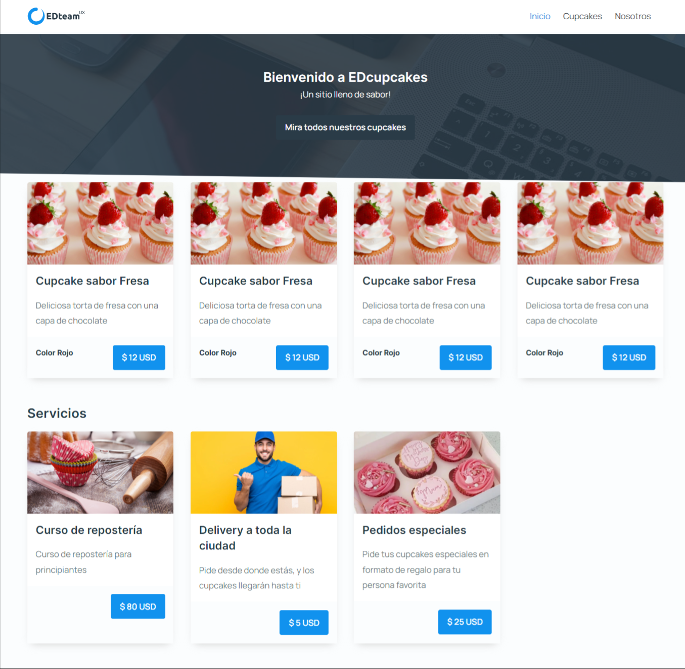
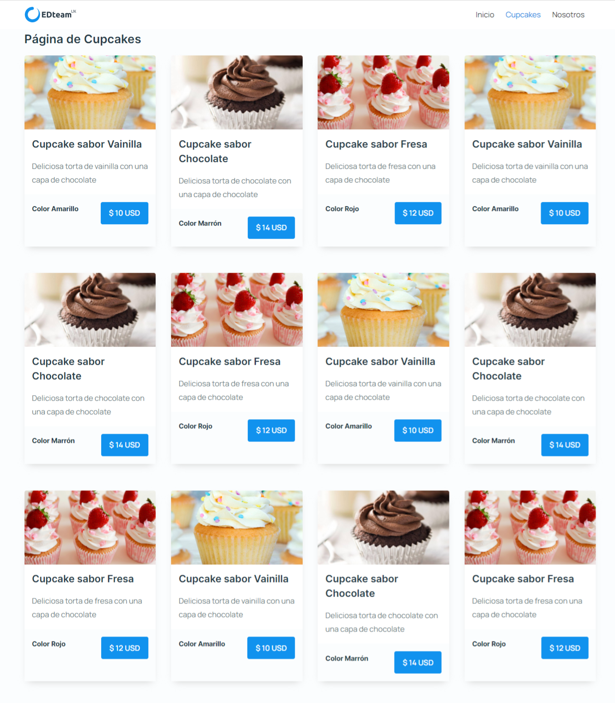
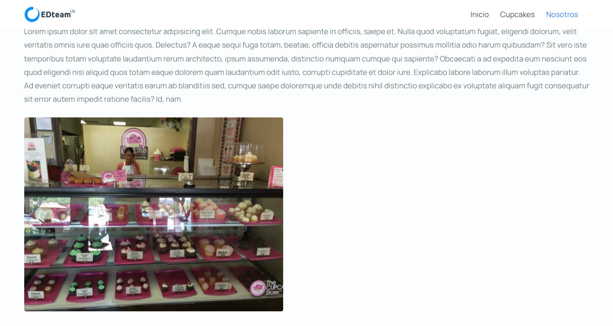
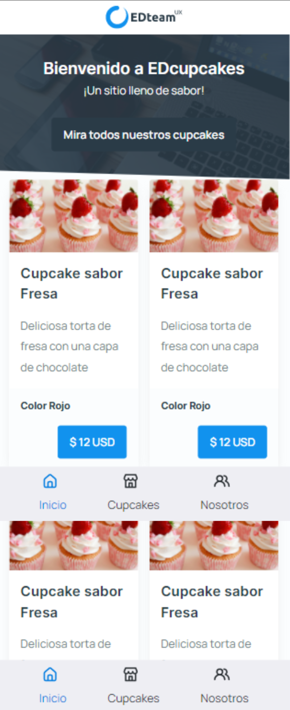
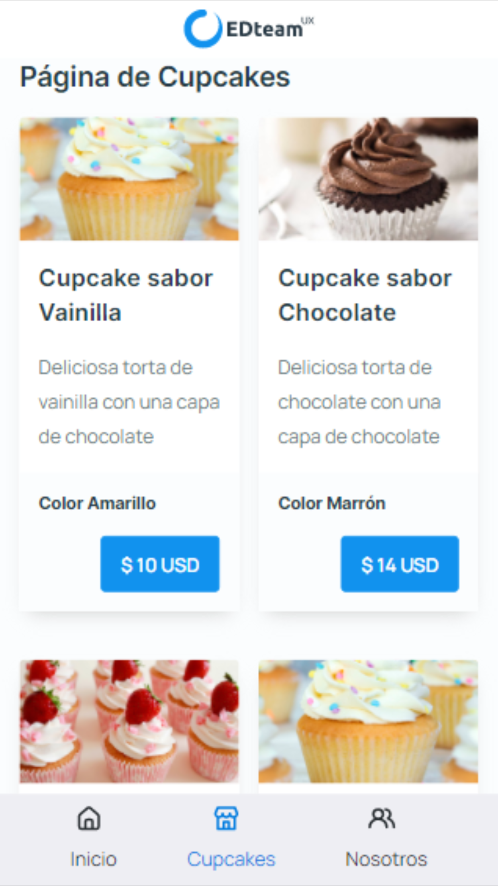
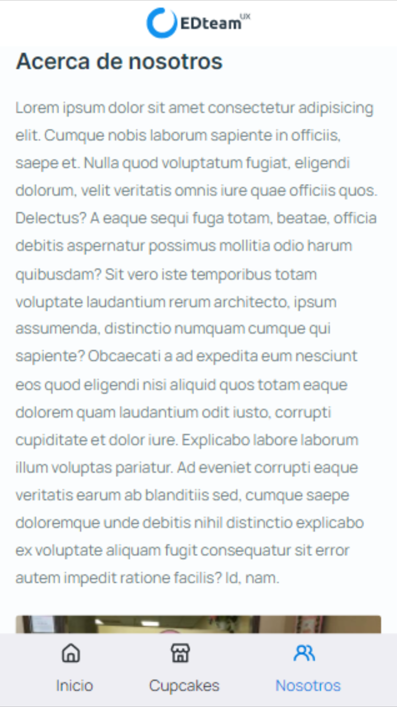
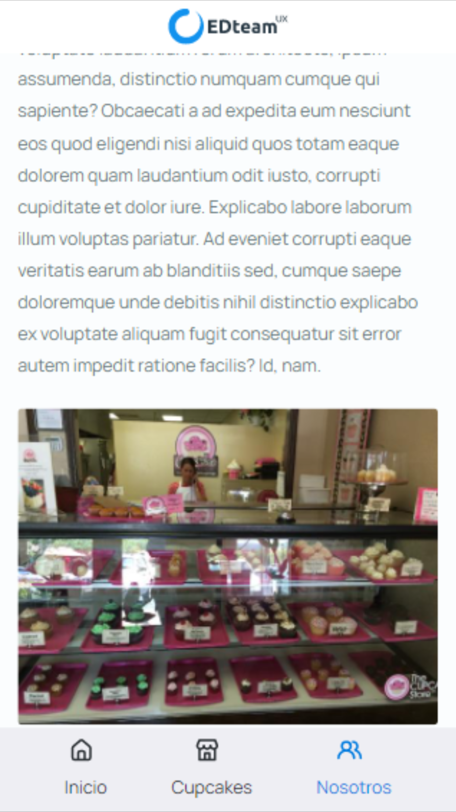
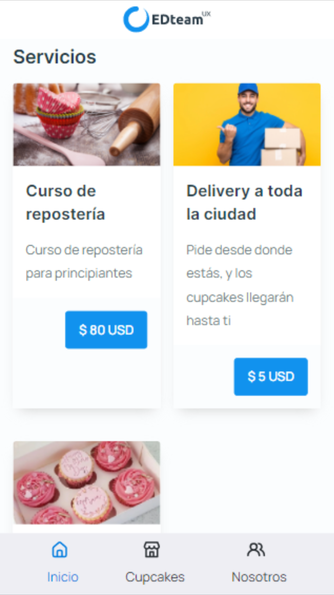

# EDcupcake 🧁

## Aplicación creada en ReactJS

Este repositorio contiene la aplicación de EDcupcake, creada en ReactJS, en el curso [React desde cero (2021)](https://app.ed.team/cursos/reactjs), impartido por [EDteam](https://ed.team/).

## Instalando las dependencias 📦

```console
npm install
```

## Ejecuta el proyecto en modo desarrollo 🚀

```console
npm run start
```

La aplicación mostrará información consumiendo una API Fake, para ejecutar la API Fake, debes acceder a la carpeta `api` y ejecutar el siguiente comando:

```console
json-server --watch db.json --port 3050
```

> 💡 Puerto 3000, por defecto.
>
> Al ejecutar el comando anterior, la API se ejecutará en el puerto 3050, especificado en el mismo comando, si no se especifica el puerto, por defecto se correrá en el puerto 3000.

Una vez hecho lo anterior, podrás acceder al link http://localhost:3000/, donde podrás ver la aplicación en funcionamiento. Si quieres acceder a la API Fake, puedes ir al siguiente link: http://localhost:3050/

## Ejecuta el proyecto en modo producción 🚀

```console
npm run build
```

<br />

## Autor del proyecto 🙋‍♂️

El desarrollo del código del proyecto fue hecho por [Jorge de Jesús Pérez López](https://portfolio-jorgeperez.netlify.app/); el autor intelectual es [EDteam](https://ed.team/).

## Demostración final de la aplicación 🎉🧁
















